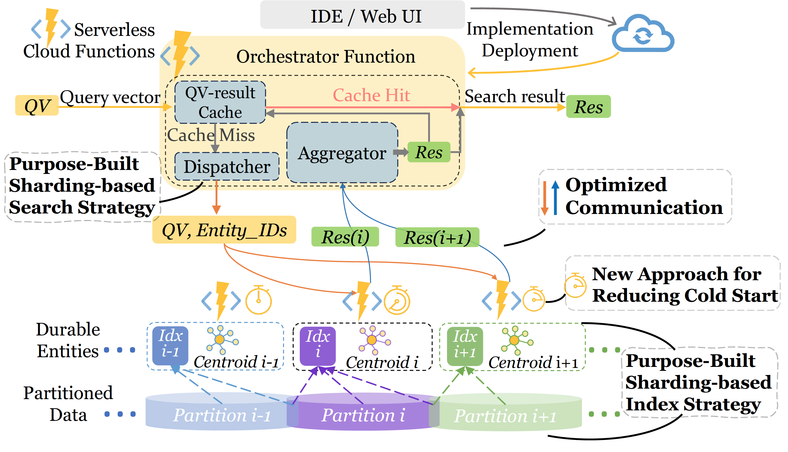
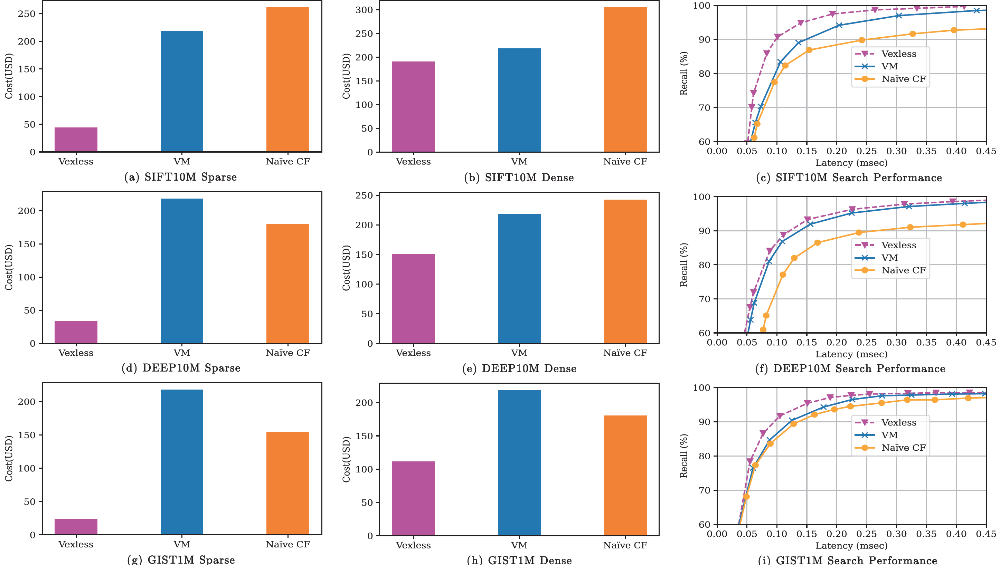

# Vexless

## Introduction

Here is the code base of Vexless, the first vector database built for Cloud Functions with the benefits of high elasticity, low operational cost, and a fine-grained billing model.

## Architecture of Vexless:

The overall architecture is shown below:


## Code Structure

```script
├── Clustering
│   ├── constrained-Vexless
│   │   └── constrained_kmeans_w_clusters.py
│   └── unbalanced-faiss
│       ├── deep100M_faiss_kmeans.py
│       ├── ...
│       └── sift10M_faiss_kmeans.py
├── Data
│   ├── DEEP
│   │   └── script.sh
│   ├── GIST
│   │   └── script.sh
│   └── SIFT
│       └── script.sh
├── Index
│   ├── DEEP
│   │   └── readme.md
│   ├── GIST
│   │   └── readme.md
│   └── SIFT
│       └── readme.md
├── Indexing
│   ├── GIST1M_hnswlib_1index.py
│   ├── constrained_kmeans_w_clusters.py
│   └── deep10M_indexing_1index.py
└── VectorSearch
    ├── Naive
    │   └── Naive_DF
    │       ├── DurableFunctionsHttpStart
    │       │   ├── __init__.py
    │       │   └── function.json
    │       ├── DurableFunctionsOrchestrator1
    │       │   ├── __init__.py
    │       │   └── function.json
    │       ├── Function
    │       │   ├── __init__.py
    │       │   └── function.json
    │       ├── host.json
    │       ├── local.settings.json
    │       └── requirements.txt
    ├── VM
    │   └── Deep10M_baseline_ANN_with_EF.py
    └── Vexless
        └── DEF_with_partitioned_vector_Search
            ├── DEF
            │   ├── __init__.py
            │   └── function.json
            ├── DurableFunctionsHttpStart
            │   ├── __init__.py
            │   └── function.json
            ├── DurableFunctionsOrchestrator1
            │   ├── __init__.py
            │   └── function.json
            ├── host.json
            ├── local.settings.json
            └── requirements.txt
```


## Setup:

Storage: Due to the original dataset, >1TB is suggested.

## Data preparation:

- Please kindly run the script in the _Data_ folder. By accessing the open-source data you can run the data clustering and indexing!

## Data indexing:

- Run the code in the _Indexing_ folder to build different indexes for further vector search in diverse solutions!

## Vector Search on Serverless Platform: 

- Deploy the code and replace the variable with your confidential account of Azure and configurations.

## 1. Creating Azure Account:

- If you don't have an Azure account, create one at the [Azure portal](https://portal.azure.com/).
- After signing up, log in to the portal to access Azure services.

## 2. Creating Subscription on Azure portal:

- Once logged in, navigate to "Subscriptions" on the left sidebar.
- Click on "+ Add" to create a new subscription.
- Choose the subscription type and provide the necessary details.
- Review and confirm your selection.

## 3. Creating Resource Group:

- In the Azure portal, go to "Resource groups" from the left sidebar.
- Click on "+ Add" to create a new resource group.
- Select your subscription, give your resource group a name, and choose a region.
- Click "Review + Create", then "Create" once validation is passed.

## 4. Creating Storage Account:

- Navigate to "Storage accounts" from the left sidebar.
- Click on "+ Add" to initiate the storage account creation process.
- Select your subscription and resource group.
- Provide a unique name for the storage account.
- Choose a region and performance tier as per your requirement.
- Review the other configurations and adjust if necessary.
- Click "Review + Create", then "Create" to finalize the storage account creation.


## 5. Creating Function Application:

- In the Azure portal, go to "Function App" from the left sidebar.
- Click on "+ Add" to start the creation process.
- Choose your subscription and resource group.
- Name your function app and select a runtime stack suitable for your application.
- Choose a region for your function app.
- Under "Hosting", select the storage account you created in the previous step.
- Configure other settings like Monitoring and Tags as per your requirement.
- Click "Review + Create", then "Create" to set up the Function App.


## 6. Run the code on Azure Function application.
- Please do follow the deployment steps and specify your account to run the code from your end.


## Evaluation results:

### Recall - Latency



### Cost analysis
The cost of different solutions can be calculated using the Azure billing [calculator](https://azure.microsoft.com/en-us/pricing/calculator/?service=functions)


